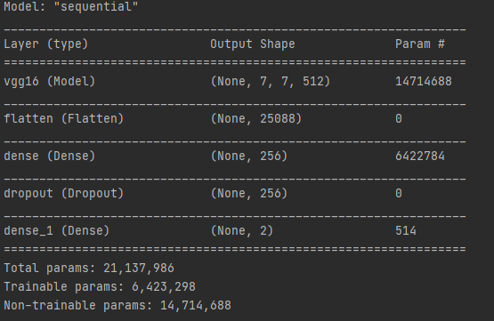
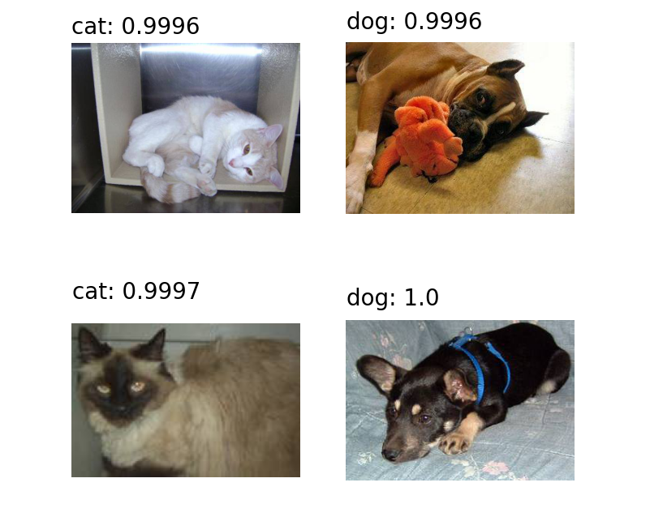
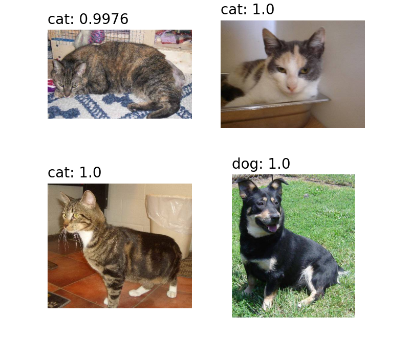
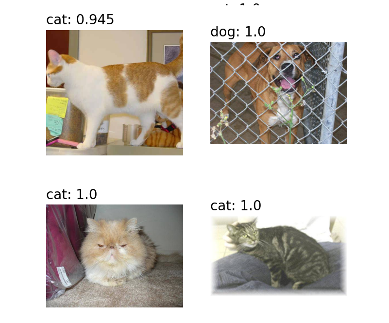
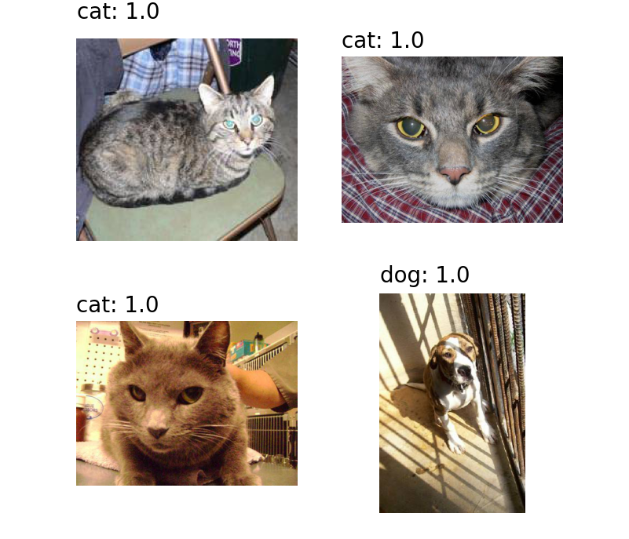
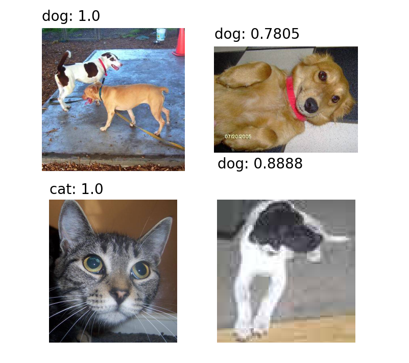

# Cats-n-Dogs-Classsification
Example cat's and dogs image classifier with Tensorflow Keras and with data from https://www.kaggle.com/c/dogs-vs-cats. Dataset includes 25K labeled images of dogs and cats and 25k unlabeled for testing.

Model with pretrained VGG-16:

optimizer: SGD(lr=0.0001, momentum=0.9)
loss: categorical_crossentropy

20k images were used for training and 5k for validation
After 5 epochs the model obtained 0.97 validation accuracy.

Results:

